# STM32F446 Custom Bootloader Project

## **Project Overview**

This project is a custom bootloader system developed for the STM32F446 microcontroller. The bootloader features firmware update capabilities via UART, flash memory read/write/erase operations, and secure transition to application code.

## **Project Contents**

### **Key Features:**
- **UART-Based Communication**: PC communication at 115200 baud rate
- **Flash Memory Management**: Read, write, and erase operations
- **Firmware Updates**: Loading binary files to flash memory
- **Checksum Verification**: Data integrity control
- **Secure Application Transition**: Safe transition from bootloader to main application
- **PyQt5 GUI**: User-friendly desktop interface
- **Real-time Debug**: UART traffic monitoring and hex dump

## **Bootloader Flow Diagram**

```mermaid
---
config:
  layout: elk
  theme: base
  look: neo
---
flowchart TD
    A["🔄 System Reset"] --> B{"🔍 Bootloader Mode?"}
    B -- Yes --> C["📡 UART Initialize"]
    B -- No --> D["🚀 Jump to Application"]
    C --> E["⏰ Wait for Command<br>Timeout: 10s"]
    E -- Timeout --> D
    E -- Command Received --> F{"📥 Parse Command"}
    F -- 0x10 --> G["📊 GET_INFO<br>Version &amp; App Address"]
    F -- 0x11 --> H["🗑️ ERASE_FLASH<br>Clear Memory Sectors"]
    F -- 0x12 --> I["✍️ WRITE_FLASH<br>Program Memory"]
    F -- 0x13 --> J["📖 READ_FLASH<br>Read Memory"]
    F -- 0x14 --> K["🔢 GET_CHECKSUM<br>Calculate CRC"]
    F -- 0x15 --> L["🚀 JUMP_TO_APP<br>Start Application"]
    F -- Invalid --> M["❌ INVALID_CMD<br>Error Response"]
    G --> N["📤 Send Response"]
    H --> O{"✅ Erase Success?"}
    I --> P{"✅ Write Success?"}
    J --> Q{"✅ Read Success?"}
    K --> R{"✅ Checksum OK?"}
    O -- Yes --> S["📤 Send RESP_OK"]
    O -- No --> T["📤 Send RESP_ERROR"]
    P -- Yes --> S
    P -- No --> T
    Q -- Yes --> U["📤 Send Data + RESP_OK"]
    Q -- No --> T
    R -- Yes --> V["📤 Send Checksum + RESP_OK"]
    R -- No --> T
    N --> E
    S --> E
    T --> E
    U --> E
    V --> E
    M --> E
    L --> W["🧹 Cleanup & Reset"]
    W --> D
    D --> X["🎯 Application Running"]
    style A fill:#e1f5fe
    style D fill:#c8e6c9
    style M fill:#ffcdd2
    style T fill:#ffcdd2
    style X fill:#c8e6c9
```



## **UART Protocol Specification**

### **Command Format:**

| Command | Value | Format | Description |
|---------|-------|--------|-------------|
| **GET_INFO** | `0x10` | `[CMD]` | Get bootloader information |
| **ERASE_FLASH** | `0x11` | `[CMD][ADDR:4][SIZE:4]` | Erase flash memory |
| **WRITE_FLASH** | `0x12` | `[CMD][ADDR:4][SIZE:4][DATA:N]` | Write flash memory |
| **READ_FLASH** | `0x13` | `[CMD][ADDR:4][SIZE:4]` | Read flash memory |
| **GET_CHECKSUM** | `0x14` | `[CMD][ADDR:4][SIZE:4]` | Calculate checksum |
| **JUMP_TO_APP** | `0x15` | `[CMD]` | Jump to application |

### **Response Codes:**

| Response | Value | Description |
|----------|-------|-------------|
| **RESP_OK** | `0x90` | Operation successful |
| **RESP_ERROR** | `0x91` | Operation failed |
| **RESP_INVALID_CMD** | `0x92` | Invalid command |

## **UART Communication Examples**

### **📊 1. Get Bootloader Information (GET_INFO)**

```
🖥️  PC → STM32:    10
📡 STM32 → PC:    90 01 00 80 00 08
                  │  │  └─────────┘
                  │  │  Application Address (0x08008000)
                  │  └─ Bootloader Version (1)
                  └─── Response OK (0x90)
```

### **🗑️ 2. Flash Erase (ERASE_FLASH)**

```
🖥️  PC → STM32:    11 00 80 00 08 00 80 00 00
                  │  └─────────┘ └─────────┘
                  │  Start Addr   Size
                  └─ ERASE_FLASH (0x11)

📡 STM32 → PC:    90
                  └─ Response OK (0x90)
```

### **✍️ 3. Flash Write (WRITE_FLASH)**

```
🖥️  PC → STM32:    12 00 80 00 08 40 00 00 00 [64 bytes data]
                  │  └─────────┘ └─────────┘ └─────────────┘
                  │  Address     Size (64)    Binary Data
                  └─ WRITE_FLASH (0x12)

📡 STM32 → PC:    90
                  └─ Response OK (0x90)
```

### **📖 4. Flash Read (READ_FLASH)**

```
🖥️  PC → STM32:    13 00 80 00 08 10 00 00 00
                  │  └─────────┘ └─────────┘
                  │  Address     Size (16)
                  └─ READ_FLASH (0x13)

📡 STM32 → PC:    90 [16 bytes data]
                  │  └─────────────┘
                  │  Read Data
                  └─ Response OK (0x90)
```

### **🚀 5. Jump to Application (JUMP_TO_APP)**

```
🖥️  PC → STM32:    15
                  └─ JUMP_TO_APP (0x15)

📡 STM32 → PC:    90
                  └─ Response OK (0x90)
                  
STM32: Bootloader closes, main application starts
```

## **Technical Details**

### **Memory Map:**
```
📍 0x08000000 - 0x08007FFF  |  Bootloader (32KB)
📍 0x08008000 - 0x0807FFFF  |  Application (480KB)
```

### **System Requirements:**
- **MCU**: STM32F446RE
- **Clock**: 84MHz (HSE/PLL)
- **UART**: USART2, 115200 baud, 8N1
- **Flash**: 512KB total
- **RAM**: 128KB

### **Bootloader Features:**
- **Circular Buffer**: 512 byte UART buffer
- **Timeout**: 10 second command waiting
- **Chunk Size**: 32-128 bytes (configurable)
- **Debug Support**: Real-time UART monitoring

## **GUI Application**

### **Features:**
- **Modern Interface**: PyQt5-based user-friendly design
- **Port Management**: Automatic COM port scanning
- **File Selection**: Drag & drop firmware loading
- **Real-time Progress**: Progress bar and status display
- **UART Debug**: Raw data monitoring with hex dump
- **Manual Control**: Flash read/write/erase operations

## **Future Enhancements**

- **MAGIC Value Jump**: Application to bootloader transition using RAM-based MAGIC value detection
- **Encryption**: AES256 encryption support
- **Digital Signature**: RSA signature verification
- **OTA Updates**: WiFi/Ethernet support
- **Multi-App**: Multiple application support
- **Recovery Mode**: Brick recovery functionality
- **Compression**: GZIP firmware compression
- **Rollback**: Previous firmware restore
- **Authentication**: Secure bootloader access

## **Troubleshooting**

### **Common Issues:**

#### **Connection Problems:**
```
Error: Serial port connection failed
Solution: Check COM port, baud rate, and cable connections
```

#### **Flash Write Errors:**
```
Error: Flash write failed at address 0x08008000
Solution: Ensure proper erase before write, check address alignment
```

#### **Timeout Issues:**
```
Error: Command timeout
Solution: Increase timeout values, check UART buffer size
```

#### **Application Not Starting:**
```
Error: Jump to application failed
Solution: Verify vector table relocation, check stack pointer
```

### **🔗 Useful Links:**
- [STM32F446 Reference Manual](https://www.st.com/resource/en/reference_manual/dm00135183.pdf)
- [AN2606: STM32 System Memory Boot Mode](https://www.st.com/resource/en/application_note/an2606-introduction-to-system-memory-boot-mode-on-stm32-mcus-stmicroelectronics.pdf)
- [PyQt5 Documentation](https://doc.qt.io/qtforpython/)
- [STM32CubeIDE Download](https://www.st.com/en/development-tools/stm32cubeide.html)

---
